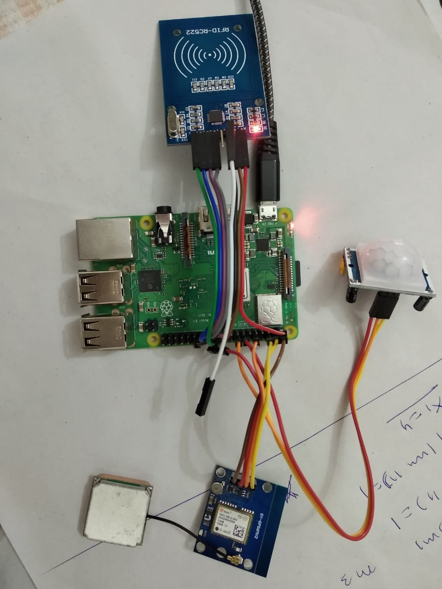
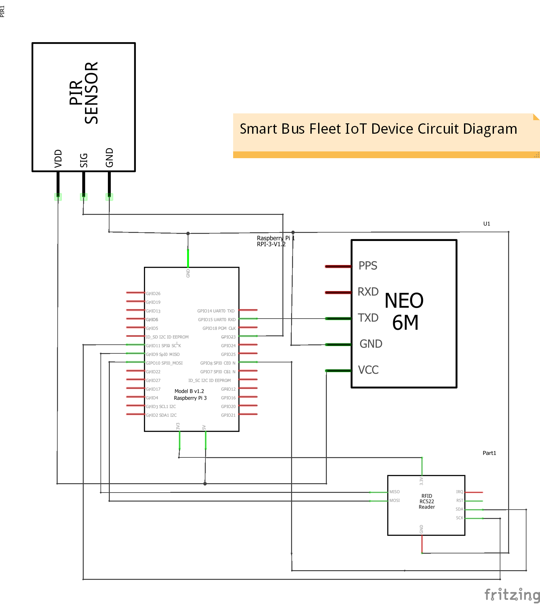
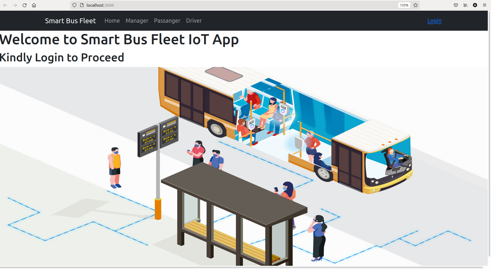
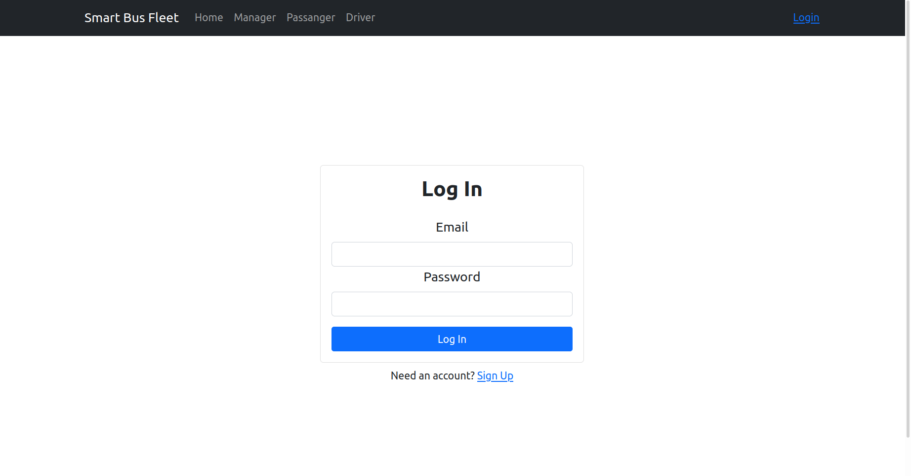
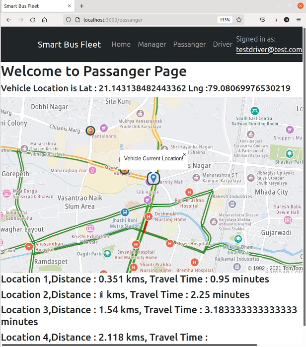
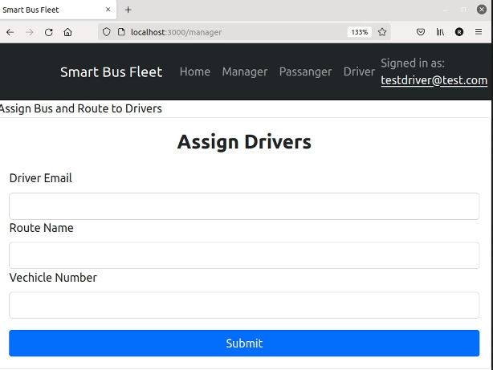
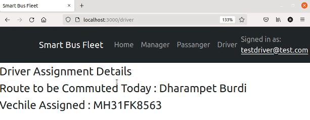

# Smart Bus Fleet Management System

Developed an IoT Device and Web Application to solve the common problem related to public transport vehicles of getting real-time location, estimated time of arrival, and other features for passengers, drivers, and fleet managers.

### Tech Stack Used 

### Overview of Methodology

.jpg)

### IoT Device

### Circuit Diagram

### Libraries/API's And Modules Used

- Tom Tom Maps API

  

  - We have used below apis for Maps related work
    - Tom Tom Web SDK Maps for Displaying the Map
    - Tom Tom Web SDK Services for Matrix Routing

- Firebase PyreBase Python API for Device And Cloud Database Connectivity

- Firebase API for Authentication, Real-Time Database, and Firestore

- RFID, Neo-6m and other device/electronics modules libraries

### Screenshots :

Home Page

User Authentication

Vechicle Current Location and Estimated Time of Arrival

Manager's Feature to Assign Driver Routes of Vehicles

Driver's Home Page

